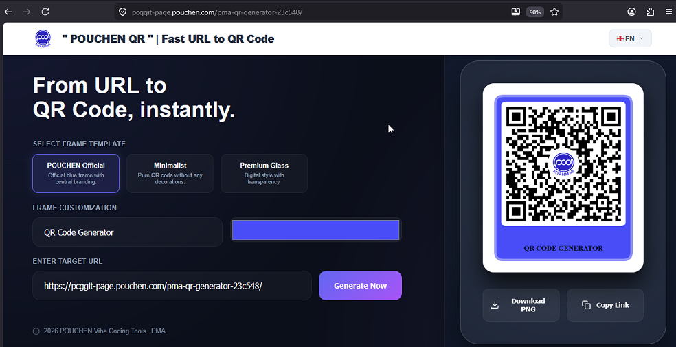

# 🏢 POUCHEN QR | Fast URL to QR Code

A professional, high-performance web application designed for generating branded QR codes instantly. Tailored specifically for **Pouchen Myanmar Adidas - B150**, this tool combines rapid generation with official identity standards.

---

## 🌍 Deployment & Access
The application is hosted in two environments to ensure internal accessibility and public availability.

| Environment | Hosting Provider | Access URL |
| :--- | :--- | :--- |
| **Internal (Primary)** | **GitLab Pages** | 
[https://pcggit-page.pouchen.com/pma-qr-generator-23c548/](https://pcggit-page.pouchen.com/pma-qr-generator-23c548/) |

| **Public (Mirror)** | **GitHub Pages** | 
[https://tinghah.github.io/pma-qr-generator/](https://tinghah.github.io/pma-qr-generator/) |

---

## 🚀 Key Features
* **Instant Branded Generation:** Converts any URL into a QR code featuring a centered POUCHEN logo and official blue frames.
* **Dynamic Frame Customization:**
    * **Label Control:** Real-time customization of frame text (e.g., Department, Asset ID, or Project Name).
    * **Color Picker:** Interactively adjust the frame color to match specific branding requirements.
* **Global Accessibility:** One-click UI localization supporting:
    * 🇺🇸 English | 🇨🇳 Chinese (ZH/TW) | 🇲🇲 Myanmar | 🇻🇳 Vietnamese | 🇮🇩 Indonesian
* **High-Resolution Export:** Optimized PNG downloads suitable for both high-quality digital displays and industrial printing.

---

## ⚙️ Technical Architecture
This project utilizes a modern CI/CD workflow integrated with internal Pouchen IT infrastructure:

* **Build Tool:** [Vite](https://vitejs.dev/) (Static Site Generation)
* **Internal Registry:** All dependencies are resolved via the internal Pouchen npm mirror (`repo.pouchen.com`).
* **Infrastructure:** Deployed via **GitLab CI/CD** utilizing Kubernetes `SGP-Prod-K8s` runners with optimized resource allocation (100m CPU / 256Mi RAM).
* **Security:** Operates as a **Client-Side Static Application**. No data is transmitted to external servers; all processing occurs within the local browser environment to maintain data privacy.

---

**Created by ting@PCaG IT © 2026 POUCHEN Vibe Coding Tools · PMA**